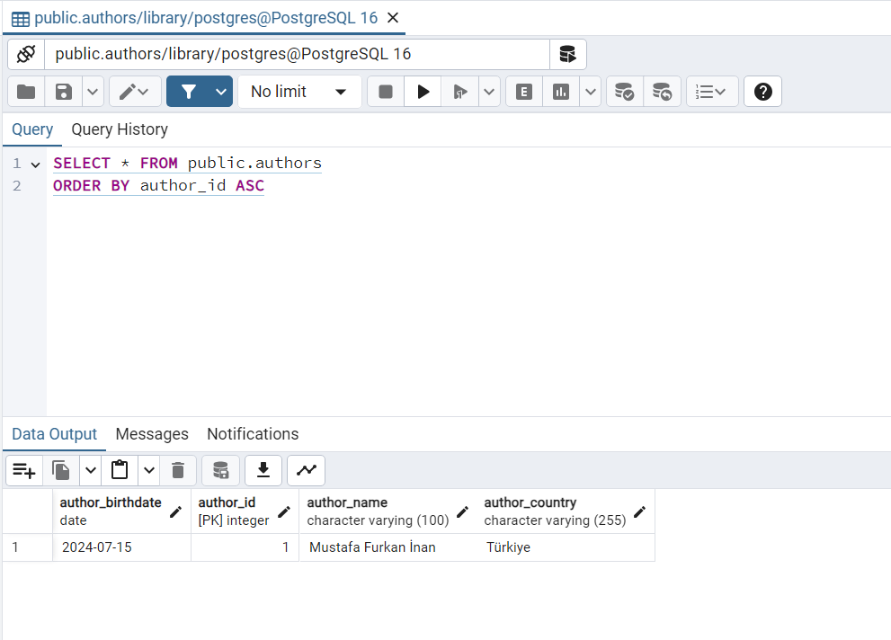
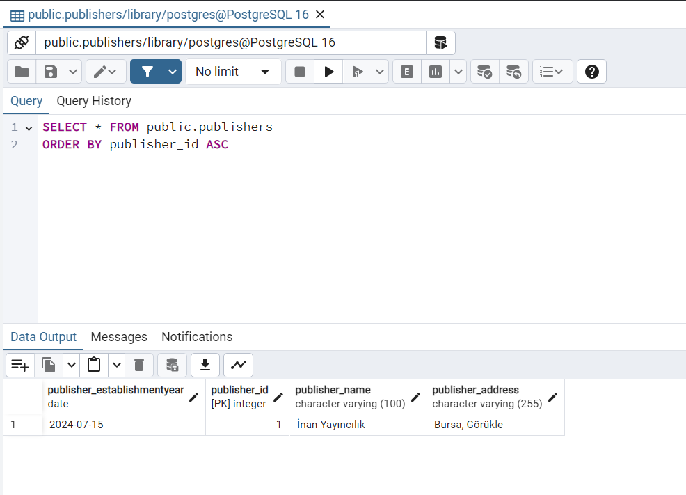
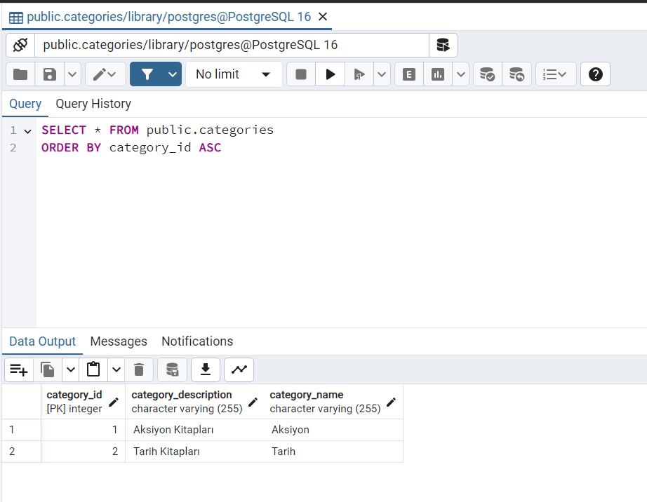
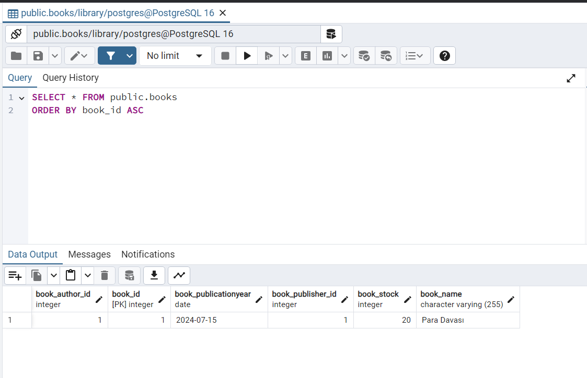
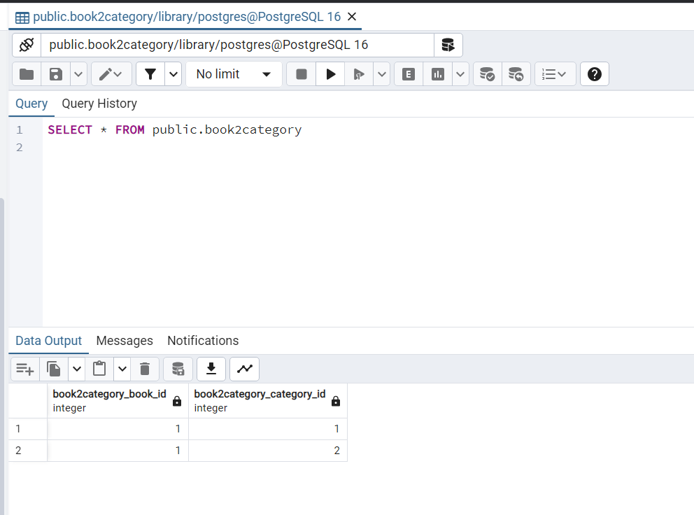
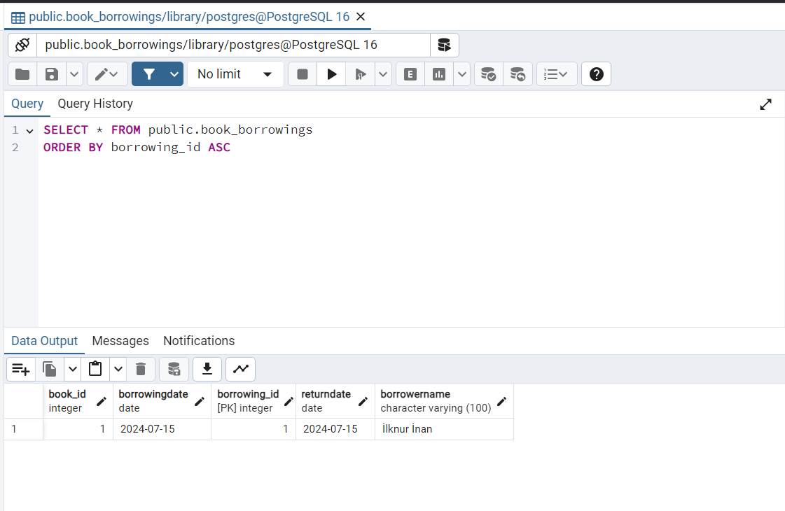

# Kütüphane Yönetim Sistemi

Bu proje, bir kütüphane yönetim sistemi geliştirmek amacıyla oluşturulmuştur. Sistem, kütüphane envanterini yönetmeyi, kitap ödünç alım süreçlerini takip etmeyi ve kullanıcıların kütüphane hizmetlerinden etkin bir şekilde yararlanmasını sağlamayı amaçlamaktadır.

## Proje Yapısı

- `pom.xml`: Maven yapılandırma dosyası. Proje bağımlılıkları ve yapılandırmaları burada tanımlanmıştır.
- `README.md`: Bu dosya.
- `src/`: Kaynak kodlarının bulunduğu dizin.
    - `main/`: Ana kaynak dosyaları.
        - `java/`: Java kaynak dosyaları.
        - `resources/`: Proje kaynak dosyaları (konfigürasyon dosyaları, statik dosyalar vb.).
    - `test/`: Test dosyaları.
- `target/`: Derlenen dosyaların bulunduğu dizin.

## Gereksinimler

- Java 8 veya üstü
- Maven 3.6.3 veya üstü

## Veritabanı Görüntüleri
### Authors

### Publishers

### Categories

### Books

### Book2Category

### Book Borrowings
